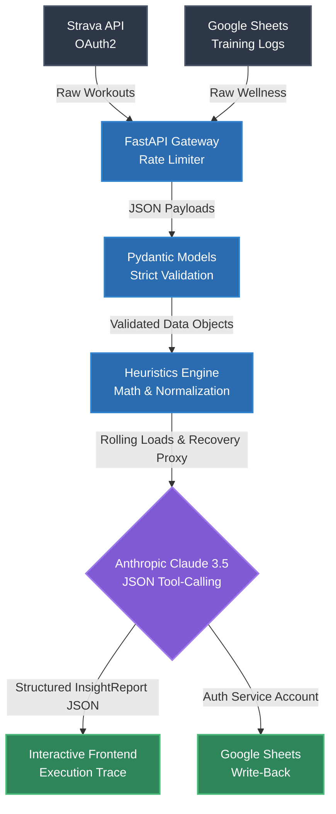

# Synth MVP: The Data Layer for Sports

An AI-powered backend pipeline built to ingest real-time athletic training logs from Strava and Google Sheets, compute deterministic heuristics, and synthesize actionable insights using Anthropic's Claude 3.5 Sonnet.


## Overview

Synth MVP solves the problem of extracting meaningful coaching insights from messy, heterogeneous sports data. Rather than relying purely on an LLM to "figure out" a spreadsheet (which causes hallucinations and context window bloat), or building a custom ML model from scratch (which fails on small, unlabeled datasets), this architecture uses a **Heuristics + LLM Hybrid approach**.

This repository contains the backend engine, API integrations, and an interactive frontend pipeline visualizer that demonstrates the complete execution trace from raw data to AI synthesis.

---

## System Architecture & Flow

For a full breakdown of why we chose LLM + Heuristics over a custom Machine Learning pipeline, read the [Design Decision Document](docs/DESIGN_DECISION.md).

The pipeline executes in 4 distinct phases:

### 1. Data Ingestion & API Integration
- **Strava OAuth2 (`app/services/strava.py`):** Authenticates athletes via OAuth2, pulling raw GPS workout data and mapping it into normalized internal structures.
- **Google Sheets Two-Way Sync (`app/services/sheets.py`):** Uses Google Cloud Service Accounts (`gspread`) to read training plans and write generated insights directly back to the coach's spreadsheet.

### 2. Strict Data Contracts
- **Validation (`app/models/schemas.py`):** We do not pass raw JSON payloads through the system. All incoming data is strictly validated and typed using **Pydantic schemas** to ensure unbreakable data contracts before it reaches the analysis layer.

### 3. The Deterministic Heuristics Engine
- **Data Normalization & Math (`app/services/triathlon_heuristics.py`):** Before AI is involved, the Python engine normalizes disparate time-series data. It calculates hard math: rolling "Training Loads" over 7-day windows, heart rate drift, and a multi-variate "Recovery Proxy" score to objectively measure athlete fatigue.

### 4. Zero-Hallucination AI Synthesis
- **Claude JSON Tool-Calling (`app/services/insights.py`):** The calculated deterministic metrics are passed to Anthropic's Claude 3.5 Sonnet. Using advanced **Tool Calling**, we force the LLM to return a strict JSON object mapped directly to our `InsightReport` schema, eliminating hallucination and ensuring predictable, structured coaching insights.

---

## Project Structure

```text
synth/
├── app/
│   ├── api/            # FastAPI routes and endpoints (/sync/strava, /sync/sheets)
│   ├── ingestion/      # CSV and data parsers
│   ├── models/         # Pydantic models (the core domain contract)
│   ├── security/       # Input validation and rate limiting
│   ├── services/       # Heuristics engines, Claude synthesis, Strava & Sheets logic
│   ├── config.py       # pydantic-settings env loader
│   └── main.py         # FastAPI application entry point
├── docs/               # Architecture diagrams and design decisions
├── frontend/           # Vanilla JS/HTML/CSS interactive pipeline visualizer
├── tests/              # Unit and integration tests
├── .env.example        # Environment variable template
├── Dockerfile          # Production container configuration
└── requirements.txt    # Python dependencies
```

## Getting Started Locally

### Prerequisites
- Python 3.10+
- Anthropic API Key (`ANTHROPIC_API_KEY`)
- Strava Developer App credentials (`STRAVA_CLIENT_ID`, `STRAVA_CLIENT_SECRET`)
- Google Cloud Service Account JSON (`GOOGLE_SERVICE_ACCOUNT_JSON`)

### Setup

1. **Clone the repository and enter the directory:**
   ```bash
   git clone <repository_url>
   cd synth
   ```

2. **Create a virtual environment and install dependencies:**
   ```bash
   python3 -m venv venv
   source venv/bin/activate
   pip install -r requirements.txt
   ```

3. **Configure the environment:**
   ```bash
   cp .env.example .env
   # Open .env and add your API keys and credentials
   ```

### Running the Application

Start the FastAPI server:
```bash
uvicorn app.main:app --reload
```

- **Frontend Visualizer:** `http://127.0.0.1:8000/`
- **API Documentation:** `http://127.0.0.1:8000/docs`
- **Strava Auth Flow:** `http://127.0.0.1:8000/strava/auth`
