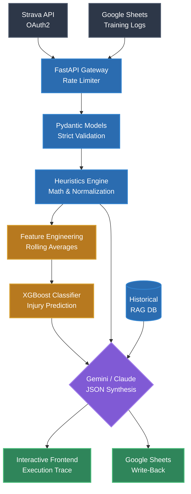

# Synth: The AI Data Layer for Endurance Sports

Synth is an advanced, production-ready backend pipeline and execution visualization tool built to ingest raw athletic training data, compute deterministic coaching heuristics, and synthesize actionable insights using a hybrid Machine Learning & Multi-LLM architecture.

This project solves the problem of extracting meaningful coaching insights from messy, heterogeneous sports data. Rather than relying purely on an LLM to "figure out" a spreadsheet (which causes hallucinations and context window bloat), or building a custom ML model from scratch (which fails on small, unlabeled datasets), this architecture uses a **Heuristics + LLM Hybrid approach** alongside targeted ML prediction models.

## Demo

https://github.com/Samanyu-dev/synth/raw/main/synth_setup.mp4

## What's Inside?

### External Features (What the User Sees)
- **Interactive Execution Tracer**: A gorgeous, node-based visualizer that traces the exact data flow of your pipelines in real time.
- **Deep-Dive Node Inspector**: Clicking on any node in the graph (e.g., `TRIMP`, `heuristics`, `Model Training`) opens an "Under the Hood" panel that explains the exact mathematical formulas and internal logic being executed.
- **Visual Data Rendering**: Direct rendering of Form Charts (Fitness vs. Fatigue) and Team Progression Heatmaps straight from the backend payloads.
- **Zero-Friction Sync**: Athletes can log their workouts in Google Sheets or Strava, and Synth automatically processes the data and injects the AI report directly back into their spreadsheet on a new tab.

### Internal Architecture (Under the Hood)
- **Deterministic Heuristics Engine**: Before any AI is involved, the Python engine calculates hard math: rolling "Training Loads" over 7 and 42-day windows, heart rate drift, and multi-variate "Recovery Proxy" scores to objectively measure athlete fatigue.
- **Multi-LLM Graceful Fallback**: The synthesis layer uses Google Gemini 2.5 Flash as the primary provider. If the API rate limits or goes down, the system silently hot-swaps to Anthropic Claude 3.5 Sonnet to ensure 100% uptime. If both fail, it degrades to a pure heuristic fallback.
- **XGBoost Machine Learning Pipeline**: A structured ML pipeline that takes engineered features (Acute/Chronic load ratios) and trains Gradient Boosted Trees to predict injury probability within a 14-day window.
- **RAG Historical Context**: Integrates a lightweight Vector/RAG layer to query 5 years of historical coaching notes via token overlap, injecting relevant past athlete context into the LLM prompts.
- **Strict Data Contracts**: All inbound and outbound data is enforced via strict Pydantic schemas, preventing prompt injection and hallucinated JSON keys.

---

## System Design & Architecture Flow



---

## Walkthrough: Tracing the Pipelines

The frontend included in this repository acts as an execution tracer. You can select different operations to watch the backend pipeline run in real-time.

1. **`triathlon.analyze()`**: Traces the analysis of CSV log data. You'll watch the data hit the heuristics engine, pass through the Multi-LLM synthesis layer, and output a validated `200 OK` JSON tree. Click the `load_summary` leaf node to view the plotted Form Chart.
2. **`rowing.analyze()`**: Traces team-wide ergometer split aggregations. Click the `heatmap_data` leaf node to see the visual grid of team progressions.
3. **`sheets.two_way_sync()`**: Traces the automated loop of reading an athlete's Google Sheet, analyzing it, and securely writing the AI insights back into a new tab on that same sheet using a Google Service Account.
4. **`ml.train_injury_model()`**: Visualizes the architecture of the Machine Learning pipeline, flowing from Data Ingestion to Feature Engineering, XGBoost Training, Evaluation, and Artifact Registry saving.

---

## Live Deployment

- **Production App:** [https://synth-mvp-production.up.railway.app](https://synth-mvp-production.up.railway.app)
- **API Documentation:** [https://synth-mvp-production.up.railway.app/docs](https://synth-mvp-production.up.railway.app/docs)

---

## Quick Start

### Prerequisites
- Python 3.10+
- Anthropic API Key (`ANTHROPIC_API_KEY`)
- Gemini API Key (`GEMINI_API_KEY`)
- (Optional) Strava Developer App credentials (`STRAVA_CLIENT_ID`, `STRAVA_CLIENT_SECRET`)
- (Optional) Google Cloud Service Account JSON (`GOOGLE_SERVICE_ACCOUNT_JSON`)

### Setup

1. **Clone the repository and enter the directory:**
   ```bash
   git clone https://github.com/yourusername/synth-mvp.git
   cd synth
   ```

2. **Create a virtual environment and install dependencies:**
   ```bash
   python3 -m venv venv
   source venv/bin/activate
   pip install -r requirements.txt
   ```

3. **Configure the environment:**
   ```bash
   cp .env.example .env
   # Open .env and add your API keys and credentials
   ```

### Running the Application Locally

Start the FastAPI server:
```bash
uvicorn app.main:app --host 0.0.0.0 --port 8000
```

- **Frontend Visualizer:** `http://127.0.0.1:8000/`
- **API Documentation:** `http://127.0.0.1:8000/docs`
- **Strava Auth Flow:** `http://127.0.0.1:8000/strava/auth`

### Deployment
This application is fully containerized with Docker and can be deployed instantly to platforms like **Railway** or **Render**. 
To deploy on Railway:
1. Connect your GitHub repository to a new Railway project.
2. Railway will automatically detect the `Dockerfile` and build the image.
3. Inject your `.env` variables into the Railway Variables dashboard.
4. Add the `PORT=8000` variable in Railway to correctly map the traffic.

---

## Project Structure

```text
synth/
├── app/
│   ├── api/            # FastAPI routes (Strava, Sheets, ML)
│   ├── ingestion/      # Data parsing pipelines
│   ├── models/         # Pydantic schema contracts
│   ├── security/       # SlowAPI Rate Limiting
│   ├── services/       # Heuristics, Multi-LLM logic, RAG
│   ├── config.py       # Environment loader
│   └── main.py         # Application entry point
├── data/               # Sample CSV databases
├── frontend/           # Vanilla JS/HTML execution visualizer
├── .env                # Environment keys
└── requirements.txt    # Python dependencies
```
