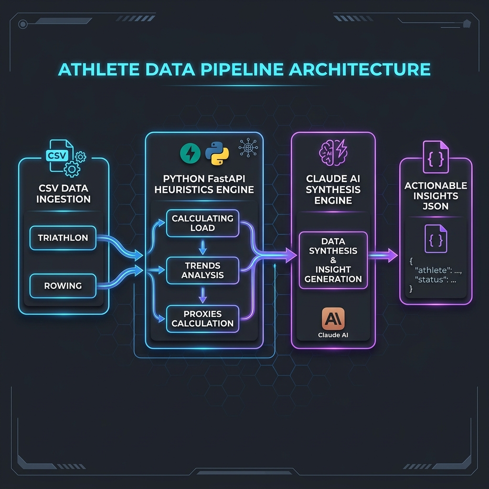

# Synth MVP: Athletic Performance Data Pipeline

An AI-powered data pipeline built to ingest athletic training logs and ergometer tests, compute deterministic heuristics, and synthesise actionable insights using Claude.



## Overview

Synth MVP solves the problem of extracting meaningful coaching insights from messy, heterogeneous sports data. Rather than relying purely on an LLM to "figure out" a spreadsheet (which causes hallucinations and context window bloat), or building a custom ML model from scratch (which fails on small, unlabeled datasets), this architecture uses a **Heuristics + LLM Hybrid approach**.

1. **Ingestion Layer:** Parses raw CSV exports from complex, multi-format spreadsheets into strongly-typed Pydantic models.
2. **Heuristics Engine:** Computes deterministic metrics (Training Load, Recovery Proxies, Split Progression, Standard Deviations).
3. **AI Synthesis:** Passes the computed summaries to Claude to generate natural language insights, risks, and recommendations, validated against a strict JSON schema.

## The Data Sources

The system currently handles two distinct domains:

### 1. Triathlon Training Log (Individual)
- **Scale:** 141 days, 375 activities.
- **Data:** Daily volume, session counts, individual activity splits, heart rate, power, pace.
- **Challenge:** Wellness columns (sleep, HRV, resting HR) are empty.
- **Solution:** A custom "Recovery Proxy" heuristic derived from rest-day recency, heart rate drift, and acute-to-chronic workload ratio.

### 2. Women's Rowing Erg Tests (Team)
- **Scale:** 52 athletes across 16 test sessions (828 individual test results).
- **Data:** Split times, watts, strokes per minute across 7 different test formats (2k, 6k, 2x6k, 4x1k, etc.).
- **Challenge:** 7 distinct sheet formats with varied columns, "sick"/"Out" flags mixed in with data, and mid-sheet machine type (RP3) separators.
- **Solution:** Format-specific parsers that normalize every sheet into a unified `ErgResult` schema, tracking athlete progression and split consistency over time.

## Architecture & Engineering Decisions

For a full breakdown of why we chose LLM + Heuristics over a custom Machine Learning pipeline, read the [Design Decision Document](docs/DESIGN_DECISION.md).

### The Pipeline Flow

1. **CSV Ingestion (`app/ingestion/`)**: Pandas is used purely for robust CSV reading and NaN handling. Rows are immediately converted to Pydantic models (`DailySummary`, `ActivityRecord`, `ErgResult`).
2. **Heuristics (`app/services/`)**: Pure Python functions calculate domain-specific metrics. For rowing, this means tracking an athlete's split progression and consistency. For triathlon, it means calculating TRIMP-inspired training loads.
3. **Synthesis (`app/services/insights.py`)**: The `TriathlonWeeklySummary` and `RowingTeamSummary` objects are converted to a clean JSON representation and injected into a strict prompt for Anthropic's Claude 3.5 Sonnet.
4. **Validation (`app/models/schemas.py`)**: Claude's response is parsed back into an `InsightReport` Pydantic model. If it hallucinates or breaks schema, it falls back gracefully to deterministic alert flags.

## Project Structure

```text
synth/
├── app/
│   ├── api/            # FastAPI routes and request schemas
│   ├── ingestion/      # CSV parsers for Triathlon and Rowing data
│   ├── models/         # Pydantic models (the core domain contract)
│   ├── security/       # Input validation and rate limiting
│   ├── services/       # Heuristics engines and Claude synthesis logic
│   ├── storage/        # SQLite database for persistent state
│   ├── config.py       # pydantic-settings env loader
│   └── main.py         # FastAPI application entry point
├── data/               # Raw CSV files (exported from original spreadsheets)
├── docs/               # Architecture diagrams and design decisions
├── tests/              # Unit and integration tests
├── .env.example        # Environment variable template
├── .gitignore          # Git exclusion rules
└── requirements.txt    # Python dependencies
```

## Getting Started

### Prerequisites
- Python 3.11+
- Anthropic API Key

### Setup

1. **Clone the repository and enter the directory.**
2. **Create a virtual environment and install dependencies:**
   ```bash
   python3 -m venv venv
   source venv/bin/activate
   pip install -r requirements.txt
   ```
3. **Configure the environment:**
   ```bash
   cp .env.example .env
   # Open .env and add your ANTHROPIC_API_KEY
   ```

### Running the Application

Start the FastAPI server:
```bash
uvicorn app.main:app --reload
```

The server will be available at `http://127.0.0.1:8000`.
You can access the auto-generated API documentation at `http://127.0.0.1:8000/docs`.

### Testing

Run the test suite with pytest:
```bash
pytest tests/
```

## Implementation Phases
- **Phase 0:** Project scaffold, config, and design decisions. ✅
- **Phase 1:** Data models and CSV ingestion pipelines. ✅
- **Phase 2:** Heuristics engine (calculating loads, trends, progression). (Next)
- **Phase 3:** Claude AI Synthesis engine.
- **Phase 4:** API routes and security.
- **Phase 5:** Final polish and integration tests.
